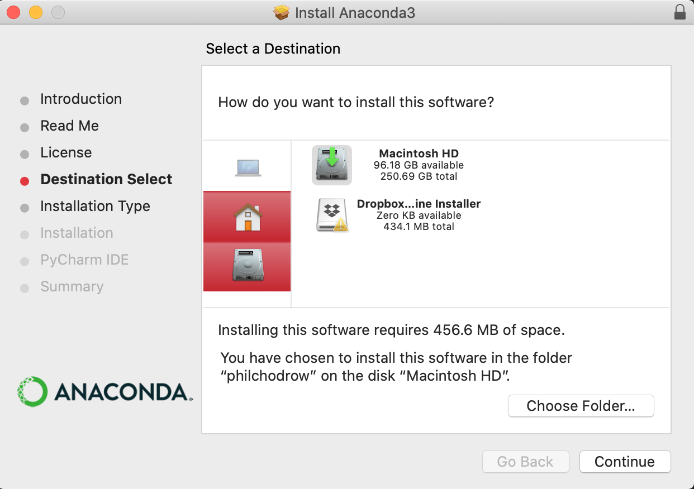
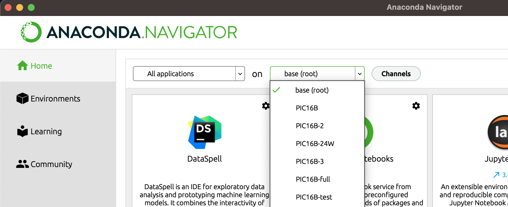
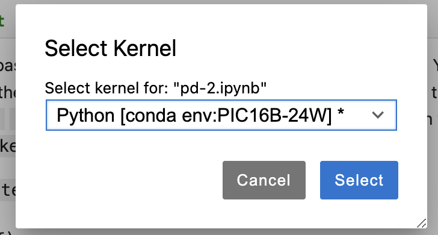

The purpose of this page is to get you set up with the software tools we’ll use in PIC 16B, including Anaconda, git + GitHub, and Quarto.

## 1. Install and Configure Anaconda
An important part of PIC16B is navigating the Python package ecosystem.


_https://xkcd.com/1987/_

We will do so using the Anaconda distribution of Python. Getting set up with Anaconda is a somewhat detailed process, outlined below.

__You should follow these instructions even if you already have Anaconda installed__. [Uninstalling](https://docs.anaconda.com/anaconda/install/uninstall/) and reinstalling is recommended.

### a. Install Anaconda

You can find installers for Anaconda [here](https://docs.anaconda.com/anaconda/install/). Choose the one appropriate to your operating system.

If installing on macOS, __do not install Anaconda in the root-level opt directory__. It is recommended that you install in the folder directly under your username. This is the same folder in which your “Downloads” folder exists. In some cases, Anaconda may suggest installing in a folder called opt under your username; this is fine.



_Example of installing Anaconda to the directory corresponding to your username._


### b. Create the `PIC16B-24F` Anaconda Environment
We will create `PIC16B-24F` anaconda environment with specific package versions. 
They are listed in a `.yml` file, depending on OS. We will fix the versions of the following python and other packages throughout the quarter: 

- python=3.11.6
- nb_conda=2.2.1
- nb_conda_kernels=2.3.1
- pandas=2.0.3
- matplotlib=3.7.2
- scikit-learn=1.3.0
- seaborn=0.12.2
- plotly=5.18.0
- scrapy=2.8.0
- twisted=22.10.0
- flask=3.0.0
- jinja2=3.1.2
- jupyter_client=7.4.9
- jupyter_core=5.3.0
- jupyter_server=1.23.4
- jupyterlab=3.6.3
- notebook=6.5.4

Download `PIC16B-24F-<os>.yml` file corresponding to your OS and run the following from the Anaconda Prompt from the directory where the file is located:
```bash
conda env create -f PIC16B-24F-<os>.yml
```
This will create a new environment PIC16B-24F, and I will use that environment in the lectures.
Full environment for each OS:

- [Windows](https://raw.githubusercontent.com/PIC16B-ucla/24F/main/posts/installation/PIC16B-24F-windows.yml) __UPDATED 10/2__
- [Mac M1/M2](https://raw.githubusercontent.com/PIC16B-ucla/24F/main/posts/installation/PIC16B-24F-mac-silicon.yml)
- [Linux](https://raw.githubusercontent.com/PIC16B-ucla/24F/main/posts/installation/PIC16B-24F-linux.yml)
- [Generic](https://raw.githubusercontent.com/PIC16B-ucla/24F/main/posts/installation/PIC16B-24F-generic.yml) -- e.g., Mac with Intel chip (sorry, I no longer own one). You may want to change conda's environment solver to [mamba](https://www.anaconda.com/blog/a-faster-conda-for-a-growing-community) for faster installation.

Note that an autograder will be in use for this course, set up on Ubuntu Linux.

#### Installing additional packages
We will mainly be using the `PIC16B-24F` environment throughout the course -- changing package versions unless prompted is discouraged. 
In the future, if you ever attempt to import a package and encounter an error, you may attempt to install it via the Environments tab on Anaconda Navigator.
Click on Channels button and add "conda-forge" channel. Then, search for the package you need on the right-hand side (you may need to update the index).

Check the box beside this package, and then click “Apply” to install.


In this course, we’ll primarily demonstrate deep learning libraries (e.g., Keras, TensorFlow, and PyTorch) using Google Colab, which has some significant benefits related to speed of computation. However, you can also try to install these packages via the package manager.

Note: If you want to use command lines to install Python packages in the future, try to follow prompts that look like

```python
conda activate PIC16B-24F
conda install --channel=conda-forge <package name>
```
rather than the ones that start with pip install. If this sentence didn’t make sense to you, you can ignore it and stick to using Anaconda navigator.


### d. Launch JupyterLab
Now launch Anaconda Navigator and open the “Home” tab. Launch JupyterLab. Select the environment `PIC16B-24F`.


_Selecting the PIC16B-24F environment on Anaconda Navigator_

Create a new Jupyter notebook. Change the kernel to the `PIC16B-24F` environment that you created in Step 1b.



_Selecting the PIC16B-24F environment from within a Jupyter notebook._


### e. Verify
Type the two lines below into your blank Jupyter Notebook and run them, adding in your name. If you do not encounter an error, then your setup was successful. Otherwise, contact the instructor or TA for help.

```python
import pandas as pd
print("My name is [your name] and I installed Anaconda")
```


### f. Creating a new environment on Anaconda (optional)

Sometimes, especially for the term project, you may want to use an environment other than what we have set up for the lectures. You can follow the step below to create a "fresh" environment.

1. Open Anaconda Navigator.
2. Navigate to the Environments tab.
3. Choose “Create.”
4. Create a Python 3.11 environment named “PIC16B-project”.


## 2. GitHub and GitHub Desktop
If you don’t have a GitHub account yet, create one on [GitHub](https://education.github.com/pack). You get a lot of free stuff as a student.

Also download [GitHub Desktop](https://desktop.github.com/), a graphical client for working with `git`. If you do not use GitHub Desktop (or another graphical client), you will need to work with `git` from the command line.

Connect your GitHub Desktop app to your GitHub account.

## 3. Pick Your Favorite Text Editor
Text editors allow you to make modifications to plaintext files. They are useful for coding, writing, and any other tasks that require the manipulation of plaintext.

I like to use JupyterLab or [Visual Studio Code](https://code.visualstudio.com/). For some reason, my VS code had trouble with Quarto, so I’m going to use JupyterLab. I sometimes use [RStudio](https://posit.co/download/rstudio-desktop/) for my Quarto editor, but that's another story.[^1]

[^1]: In fact, Quarto is created by people in Posit, previously RStudio.

[Sublime Text](https://www.sublimetext.com/) and [Atom](https://atom.io/) are also popular. Some people also use Notepad++ but that might not be the best option for beginners. Beyond this course, if you expect to write a significant amount of code in your career then it is worthwhile to find a text editor that you like.

Once you’ve installed a text editor that you like, try opening it up and modifying a text file.

Next, try writing a simple Python file and running it from your editor. To do this, first paste the following into a file called `my_script.py`:

```python
print("I can run Python scripts from my text editor!")
```

Then, open a terminal window from your editor. In the terminal, write `python3 my_script.py` and hit enter. You’ll need to ensure that your terminal is in the same location as the file `my_script.py`.

## 4. Install Quarto
In this course, we’ll use Quarto to create a simple, attractive website on which to host our homework and project submissions.

Follow the instructions here: https://quarto.org/docs/get-started/Links
